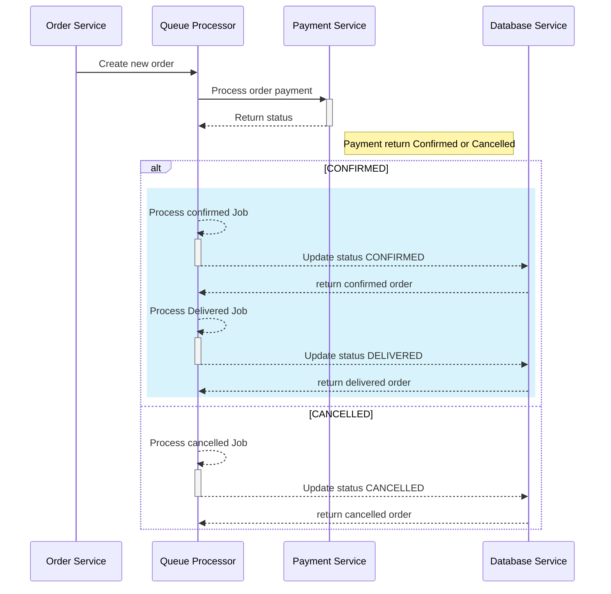

### Acceptance Criteria
- [x] As a User, I should be able to see an orders list with the corresponding data
- [x] s a User, I should be able to open order page with the detail information about the order
- [x] As a User, I should be able to cancel an order
- [x] As a User, I should be able to create an order


### Web application

- Products Page
  

- Order List Page
  

- Order detail Page
  

- Cancel Order
  

- Product Carts Page
  

### High Level Design


### Sequence Diagram

- Assume in a large order system such as Amazon or the biggest E-commerce site will process a thousand orders in a short time so that reason I choose a Queues processor to apply in this assignment.
- Queues are a powerful design pattern that helps you deal with common application scaling and performance challenges




### Code Structure

- **clients**: web application
  - src/server: GraphQL Server
- **services**
  - orders: order service logic
  - payments: order payment verification will return Confirmed or cancelled
    status using `Random Number` to compare with constant value
- **infras**
  - deployments: all the deployment resource will define separately for each service
  - services: all the related service such as order, payment, web app ...
  - Ingress Controller: define all mapping rules from traffic from outside the Kubernetes to cluster service 
  
- **desgine**
  - screenshot web app

### How to run application

- Because Order Service using Queues and it depends on Redis hence need to install Redis on local machine first we can reference this link how to install Redis on your machine [install redis guidline](https://gist.github.com/tomysmile/1b8a321e7c58499ef9f9441b2faa0aa8)
- Start Web App

```bash
   cd clients
   yarn
   yarn start
```

and order to tart test should run with command below

```bash
   yarn test
```

after running all the above command the web app will start on the http://localhost:3000

- Start Order Service

```bash
   cd services/orders
   npm ci
   npm run start
```

after running all the above command the web app will start on the http://localhost:8000

- Start Payment Service

```bash
   cd services/payments
   npm ci
   npm run start
```

after running all the above command the web app will start on the http://localhost:8001

### Technologies stack used

- ReactJS version 17.0.2
- Rect Testing library
- GraphQL
- Json Server
- NestJS
- Cloud Mongo DB
- Rabbit MQ
- TypeScript

### APIs End points

- **Order Service**

  - GET: v1/api/orders
    - Get list of orders
    ```curl
    curl --location --request GET 'http://localhost:8000/v1/api/orders'
    ```
  - POST: v1/api/orders
    - Create Order
    ```curl
    curl --location --request POST 'http://localhost:8000/v1/api/orders' \
    --header 'Content-Type: application/json' \
    --data-raw '{
      "orderItems":[
          {
            "id":"1",
            "name":"IT Book",
            "url":"url",
            "price":500000,
            "quantity":1
          }
      ],
      "metadata":{
          "firstName":"Trung",
          "lastName":"Nguyen",
          "address":"HCM",
          "notes":"88",
          "phoneNumber":"0906925896"
      },
      "notes":"Nothing"
    }'
    ```

- DELETE: v1/api/orders/:orderId
  - Cancel Order

### What should I will improve for a better
- Improve UI/UX allow user can change the quantity of selecting books in the product carts page
- Update test coverage and add integration test level
- Using HELM charts which simplifies the deployment of containerized application
